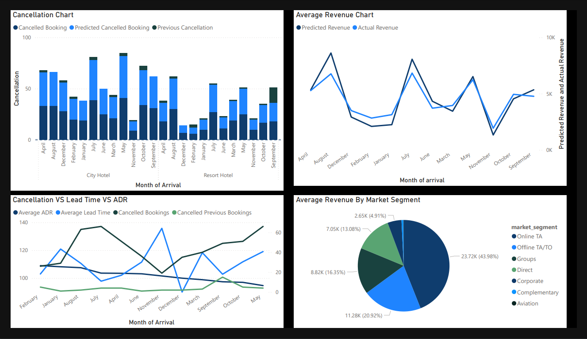
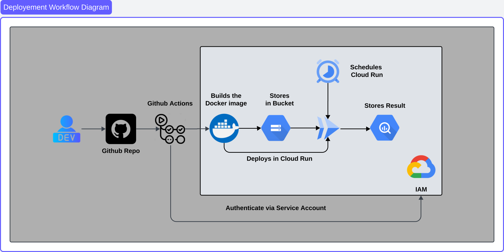

# **Hotel Bookings Analysis and Optimization Project**

This project aims to analyze and optimize hotel bookings data to improve data quality, generate meaningful insights, and support decision-making through advanced analytics and predictive modeling.

---

## **Table of Contents**
1. [Project Overview](#project-overview)
2. [File Structure](#file-structure)
3. [Objectives](#objectives)
4. [Dataset Details](#dataset-details)
5. [Getting Started](#getting-started)
6. [Project Phases](#project-phases)
7. [Contact](#contact)

---

## **Project Overview**

The project focuses on:
- Cleaning, transforming, and analyzing hotel booking data.
- Developing data pipelines for real-time and batch processing.
- Building predictive models for cancellations and revenue forecasting.
- Visualizing insights with interactive dashboards.

---

## **File Structure**
```
.github/workflow/
    - gcp_deployment.yaml         # Automates Docker Builds and GCP Cloud Run deployments
    - upload_models               # Workflow to upload model files to GCP

data/
    - cleaned_data.csv            # Cleaned dataset
    - hotel_bookings.csv          # Raw dataset

Deployment/
    - Dockerfile                  # Defines the Docker image build process
    - main.py                     # Core Flask app for the pipeline
    - requirements.txt            # Python dependencies
    - readme.md                   # Detailed deployment instructions

Exploration/
    - Data_exploration.ipynb      # Initial data exploration notebook
    - EDA_Visualization.ipynb     # Advanced visualizations and entity relationship analysis

images/
    - Architecture_Diagrams/      # Architecture diagrams for the project

legacy_models/
    - Old models trained by the team

Model_Generator/
    - Adr_model.py                # Predicts ADR using Optuna-optimized models
    - Cancellation.py             # Predicts cancellations using Optuna
    - compare_model.ipynb         # Proof of concept for model comparisons

Models/
    - Best performing `.pkl` model files

Report/
    - Analysis reports on data generation, EDA, and raw data

Visualization/
    - Power BI reports for reference
```

---

## **Objectives**
### **1. Data Cleaning and Preprocessing**
- Handle missing values and standardize data formats.
- Detect and handle outliers to ensure data quality.

### **2. Data Analysis**
- Conduct exploratory data analysis (EDA) to identify key patterns and trends in booking behavior.

### **3. Data Pipeline Development**
- Build an optimized pipeline for both batch and real-time data processing.

### **4. Predictive Modeling**
- Develop machine learning models to predict:
  - Booking cancellations.
  - Average daily revenue (ADR).
  - Demand forecasting for resource optimization.

### **5. Data Visualization**
- Create dashboards for:
  - Monitoring key metrics.
  - Supporting stakeholders in making data-driven decisions.

---

## **Dataset Details**
- **Name**: HotelBookings.csv
- **Description**: 
  - Includes hotel booking information such as booking dates, cancellation status, customer details, and room preferences.
- **Fields**:
  - **Categorical**: Hotel type, market segment, etc.
  - **Numerical**: Lead time, ADR, number of special requests, etc.

---

## **Getting Started**

### **Prerequisites**
- **Python**: Version 3.8 or higher.
- **Python Libraries**:
  - Data Handling: `pandas`, `numpy`
  - Visualization: `matplotlib`, `seaborn`
  - Machine Learning: `scikit-learn`, `optuna`
- **Database (Optional)**: SQL-based for data warehousing.
- **Visualization Tools**: Power BI or Tableau (optional).

---

## **Project Phases**

### **Phase 1: Data Exploration and Cleaning**
- Initial dataset inspection and preprocessing.
- Deliverables: [EDA Analysis Report](./Reports/EDA_Analysis.md)

### **Phase 2: Data Pipeline Development**
- Develop scalable data pipelines for:
  - Data cleaning and transformation.
  - Real-time and batch processing.
- Architecture: 
  
- Deliverables: [Pipeline Report](./Deployment/readme.md)

### **Phase 3: Predictive Modeling and Visualization**
- Build and evaluate machine learning models.
- Create visualizations in Power BI for business insights.
- 

### **Phase 4: Deployment**
- Deploy the project using Docker and GCP Cloud Run.
- Architecture: 
  
- Deliverables: [Deployment Report](./Deployment/readme.md)

---

## **Contact**
For any questions, suggestions, or feedback, feel free to reach out:

**Email**: g23ai2071@iitj.ac.in  


